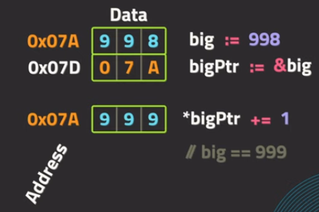

### Pointers

Вызовы функций в Go осуществляются по значению
    Создается копия каждого аргумента функции, независимо от их размера
        Может быть потенциально медленным для больших структур данных
        Более сложно управлять состоянием программы
Можно изменить, используя указатели

Указатели - переменные, которые указывают на определенную область в памяти (адрес переменной в памяти)
```
a := 5
pointer := &a // указатель на переменную в памяти
*pointer == 5 // значение переменной
```
Значение самой переменной представляет собой адрес в памяти
    Для доступа к данным необходимо выполнить разыменование указателя
    Это позволяет изменить значения, которые существуют в других частях программы

Оператор разыменования (*) вместе с типом указывает, что значение является указателем
Амперсанд (&) создает указатель на переменную
```
value := 10
var valuePtr *int // указатель на тип переменной
valuePtr = &value // указатель на значение
```
(*) при использовании с указателем будет разыменовывать указатель
    Это предоставляет доступ к фактическим данным, на которые указывает указатель:
```
func increment(x *int) {
    *x += 1
}
i := 1
increment(&i)
// i == 2
```


Указатели используются для изменения данных, существующих вне функции
(*) перед типом указывает, что тип является указателем
(&) создает указатель
(*) перед переменной разыменовывает указатель
Операции с разыменованным указателем выполняются над исходными данными